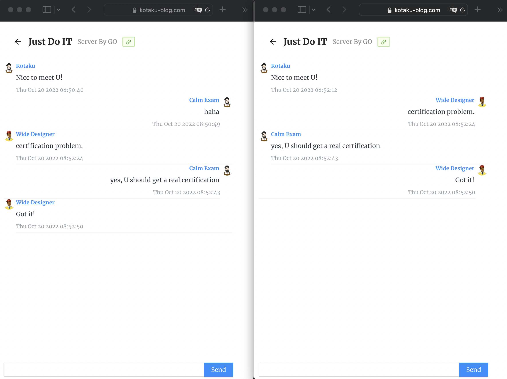
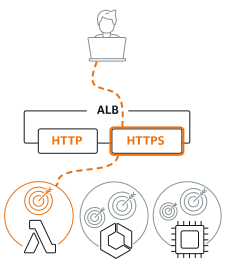

After successful local debugging, I deployed the latest code to the production environment, but I found that the chat room in the production environment could not link to my GO server's websocket service.

Because in debug environment I use http website to connet my GO server's websocket, but in production environment [kotaku-blog.com](https://www.kotaku-blog.com) is secure website uses https.

> ##### [Chrome don't allow insecure WebSocket connections (ws) from secure websites (https)](https://www.damirscorner.com/blog/posts/20210528-AllowingInsecureWebsocketConnections.html)

Although I can get around this issue during the debugging phase, the production environment has to be addressed.

I create myself SSL certification for my GO https server.

Follow this article [Secure HTTPS servers in Go](https://medium.com/rungo/secure-https-servers-in-go-a783008b36da) I start the https server in GO.

    err := http.ListenAndServeTLS(":80", "cert.cer", "private.key", nil)
    if err != nil {
    log.Fatal("ListenAndServeTLS: ", err)
    }

But the browser still pops up a warning that you need to trust this certificate manually to do so.

After trust my certificate manually, I can connet to WSS websocket in https://www.kotaku-blog.com.

So I need a real TSL certificate for this to work.

I applied for a new domain by Router53 and applied for a certificate at AWS ACM.

But I can not download the cer and key files.

I had to add Application Load Balance (ALB) in front of the EC2 instance, which is also used to do this exactly.

> You can use an HTTPS listener to offload the work of TLS encryption and decryption to your load balancer.

If you encounted the 503 service temporarily unavailable, refer to [here](https://nadtakan-futhoem.medium.com/aws-load-balancer-503-service-temporarily-unavailable-e1e91c0dfcdb)

Remember to add a A record for you domain which route traffic to ALB.

So I just start a http GO server, it is OK.

    err := http.ListenAndServe(":80", nil)
