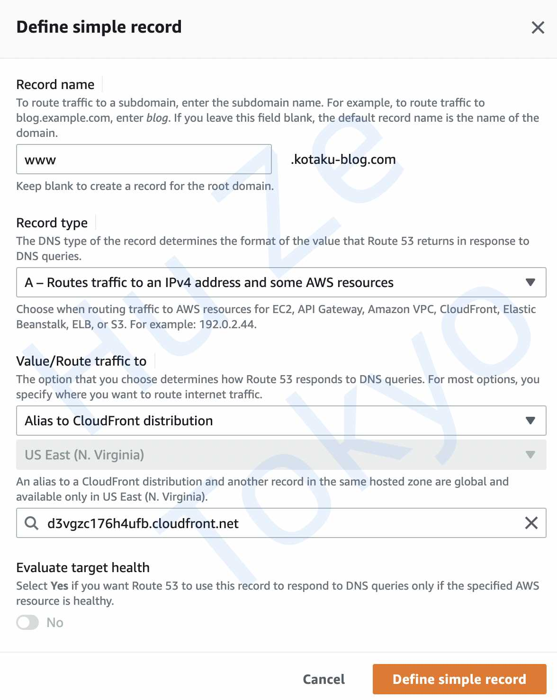

When you set up your CloudFront distribution, straight out of the box with the default settings you will have your own cloudfront.net domain.

> #### Apply for your own domain.

To use a custom domain requires a combination of **Route 53** — Amazon’s highly available and scalable cloud DNS web service — and some additional configuration CloudFront.

You can register domain in Router53 service directly.

> #### Request a certification

There is an initial step to obtain an SSL Certificate within **AWS Certificate Manager**. This allows you to serve your content over https and is a service provided by Amazon for **_free_**, and they’ll also take care of its renewal.

**AWS Certificate Manager** can Create CNAME type records in Route 53!

> #### Set up Alternate Domain Name

Now head over to CloudFront and set up your custom domain.

The setting is to list all your **Alternative Domain Names** in the CloudFront distribution settings.

> #### Final step

In your domain hosted zone in Route 53, select to **Create Record Set**.  
You should create an **A record** for IPv4 and AWS resouces.

You will find that you are now able to view your website using your domain, with all the added benefits of CloudFront providing edge locations around the world to reduce latency for your visitors.

You will also have an SSL Certificate that is managed by Amazon and will be automatically renewed for you.

> So easy!! Awesome!!
