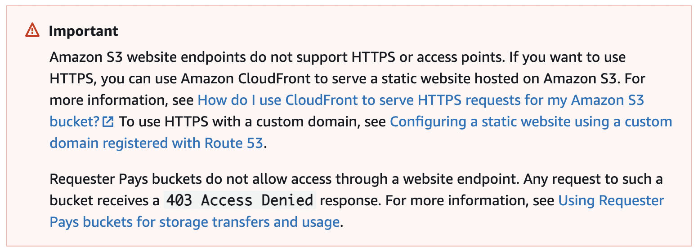
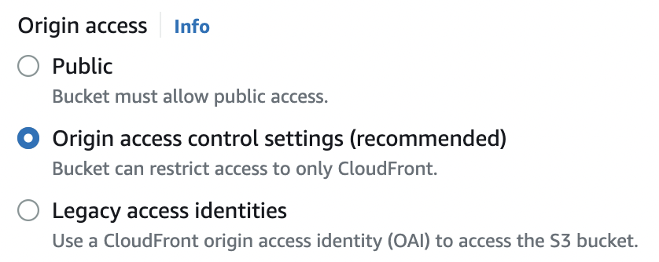
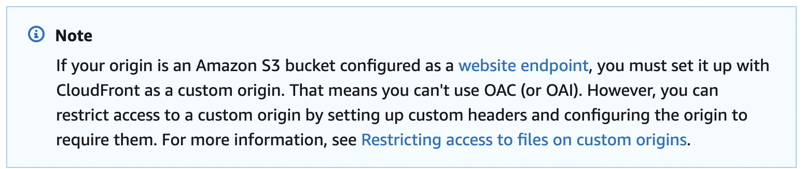

I had thought it would be easy to implement the deployment of the blog using S3+CloundFront.

But there was a small problem that took me 3 hours to solve.

I will explain some basic operations.

> 1. Create an S3 Bucket
> 2. Upload your website cotent to S3
> 3. Add a bucket policy to allow public reads
> 4. Enable website hosting

The detail operation please refer to [Build a Serverless Web Application](https://aws.amazon.com/getting-started/projects/build-serverless-web-app-lambda-apigateway-s3-dynamodb-cognito/module-1/?nc1=h_ls)

Amazon S3 website endpoints do not support HTTPS or access points. If you want to use HTTPS, you can use Amazon CloudFront to serve a static website hosted on Amazon S3.

I refer to the [cloudfront develop guide page](https://docs.aws.amazon.com/AmazonCloudFront/latest/DeveloperGuide/private-content-restricting-access-to-s3.html)

I want to use Https, but S3 static website do not support it.

Use cloudfront to access S3 is more safe than open public access permit to S3. I think so too, then I close the public access permit for my S3 bucket.

When I finished configuring cloudfront and S3 related permissions, I found that I could not access S3 website by the cloudfront url. Access is denied.

    {
    "Sid": "1",
    "Effect": "Allow",
    "Principal": {
    "AWS": "arn:aws:iam::cloudfront:user/CloudFront Origin Access Identity EAF5XXXXXXXXX"
    },
    "Action": "s3:GetObject",
    "Resource": "arn:aws:s3:::AWSDOC-EXAMPLE-BUCKET/\*"
    }

I check the S3 Bucket policy several times, the policy is absolutely right!!

As the picture showed, I choose the recommended origin access method.

**It was for this reason that I spent a few hours resolve it.**

#### S3 website endpoint type can't use OAC (or OAI) to access.

> It's really so unexpected!!
