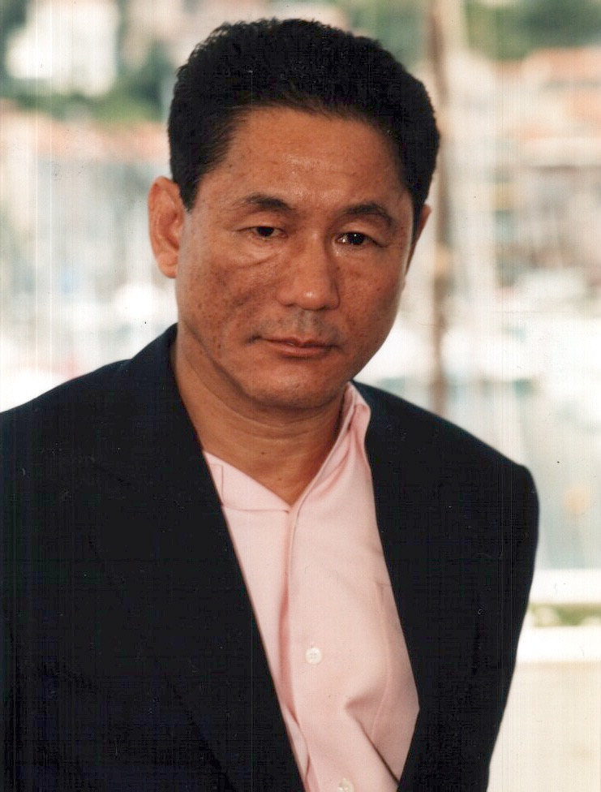

## [ビートたけし](https://ja.wikipedia.org/wiki/%E3%83%93%E3%83%BC%E3%83%88%E3%81%9F%E3%81%91%E3%81%97)

> 金のことでつべこべ言うと、母親にこっぴどく叱られたものだ。誰だって、金は欲しいに決まっている。だけど、そんなものに振り回されたら、人間はどこまでも下品になるというのが俺の母親の考えだった。

---

> 料理人に会ったら料理のこと、運転手に会ったらクルマのこと、坊さんに会ったらあの世のことでも何でも、知ったかぶりせずに、素直な気持ちで聞いてみたらいい。自慢話なんかしているより、ずっと世界が広がるし、何より場が楽しくなる。たとえ知っていたとしても一応ちゃんと聞くんだ

---

> 人は何か一つくらい誇れるものを持っている。何でもいい、それを早く見つけなさい

---

> 自分はまだ未熟だと言い訳にしてる奴が多いが、君達は完璧な人を見たことあるのか？俺はここまでの人生で、まだ出会って無いし、これからも出会わ無いだろうよ

---

> 鳥のように、自由に空を飛べたら、魚のように泳げたら、なんて思わない。自由を楽しむ生き物などいない。生きて行く事は、つらく、悲しく、目的も分からないものだ。

---

> 物体は激しく動けば、それだけ摩擦が大きくなる。人間だって、激しく動くと熱を持つのだ。はたから見れば、輝いている人間のことが、きっと羨ましく見えるのだろう。だけど、輝いている本人は熱くてたまらない
