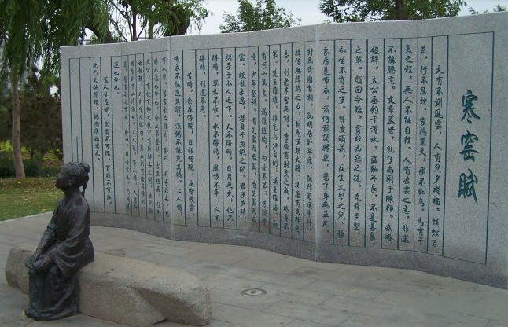

> - 《时运赋》又名《寒窑赋》、《命运赋》，是吕蒙正的经典之作。吕蒙正曾三次入相，兼任太子的老师。当时太子狂傲不羁，目中无人，没有哪个太师敢当面教训太子。吕蒙正于是写了这篇《时运赋》。李亮德先生说虽然内容短小，但是却包含了无穷智慧，太子读过此文后，立刻一改常态，从此谦卑待人虚心求教。

> 天有不测风云，人有旦夕祸福。

> 蜈蚣百足，行不及蛇。  
> 家鸡翼大，飞不及鸟。  
> 马有千里之程，无人不能自往。

> 人有凌云之志，非运不能腾达。  
> 文章盖世，孔子尚困于陈邦；武略超群，太公垂钓于渭水。

> 盗跖年长，不是善良之辈；颜回命短，实非凶恶之徒。  
> 尧、舜至圣，却生不肖之子；瞽叟顽呆，反生大圣之儿。

> 张良原是布衣，萧何称谓县吏。  
> 晏子身无五尺，封为齐国首相；孔明卧居草卢，能作蜀汉军师。  
> 韩信无缚鸡之力，封为汉朝大将；冯唐有安邦之志，到老半官无封。
> 李广有射虎之威，终身不第。  
> 楚王虽雄，难免乌江自刎；汉王虽弱，却有江山万里。

> 满腹经纶，白发不第。  
> 才疏学浅，少年登科。  
> 有先富而后贫，有先贫而后富。  
> 蛟龙未遇，潜身于鱼虾之间。  
> 君子失时，拱手于小人之下。

> 天不得时，日月无光。  
> 地不得时，草木不长。  
> 水不得时，风浪不平。  
> 人不得时，利运不通。
