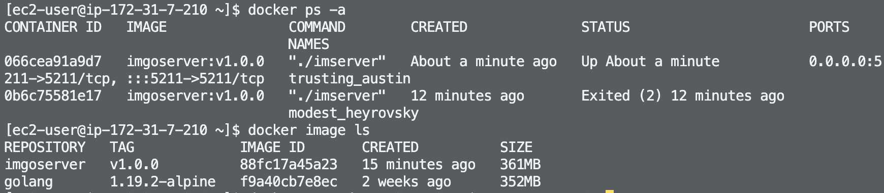

> ##### Install Docker on AWS EC2.

Update the installed packages and package cache on your instance.

    sudo yum update -y

Install the most recent Docker Engine package.

    sudo amazon-linux-extras install docker

Start the Docker service.

    sudo service docker start

To ensure that the Docker daemon starts after each system reboot, run the following command:

    sudo systemctl enable docker

Add the ec2-user to the docker group so you can execute Docker commands without using sudo.

    sudo usermod -a -G docker ec2-user

Log out and log back in again to pick up the new docker group permissions.Your new SSH session will have the appropriate docker group permissions.

Verify that you can run Docker commands without sudo.

    docker info

> ##### Write a simple Dockerfile to describe Go application.

Create a file called Dockerfile. A Dockerfile is a manifest that describes the base image to use for your Docker image and what you want installed and running on it.

    touch Dockerfile

Edit the Dockerfile

    FROM golang:1.19.2-alpine

    WORKDIR /Users/huze/Desktop/gotest/GoIMServer/src

    ADD . .

    RUN go build -o imserver

    CMD [ "./imserver" ]

Build the Docker image from your Dockerfile.

    docker build -t imgoserver .

> ##### Run Docker containers on AWS.

Start a container based on the image you built in the previous step.

    docker run -d -p 80:80 imgoserver:v1.0.0

