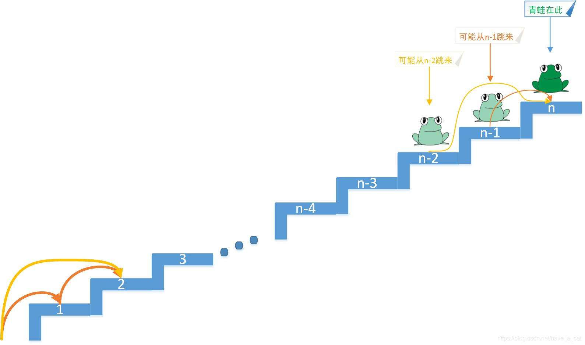

#### 斐波那契数列

> 斐波那契数列是一个以 0 和 1 开始，后续每一项都是前两项之和的数列。

以下是斐波那契数列的前 20 项以及代码描述：  
 0, 1, 1, 2, 3, 5, 8, 13, 21, 34, 55, 89, 144, 233, 377, 610, 987, 1597, 2584, 4181

        fun fibonacci(n: Int): Int {
            return if (n <= 1) {
                n
            } else {
                fibonacci(n - 1) + fibonacci(n - 2)
            }
        }

通俗一点来说，斐波那契数列就是说，这个数列的某一个位置的值 f(n)，是由该位置的前面一个 f(n-1)和前面的前面一个 f(n-2)的值决定的。

**经典例子**：
在 n 个台阶面前，有一只青蛙，青蛙每次可以跳 1 阶台阶或者 2 阶台阶，请问青蛙跳上 n 阶台阶，有多少种跳法？

这个题目是面试的时候经常碰到的题目，就是斐波那契数列。

下面看一下 leetcode 上面的一题：

> - [62. Unique Paths](https://leetcode.com/problems/unique-paths/?envType=study-plan&id=level-1)

        There is a robot on an m x n grid.
        The robot is initially located at the top-left corner (i.e., grid[0][0]).
        The robot tries to move to the bottom-right corner (i.e., grid[m - 1][n - 1]).
        The robot can only move either down or right at any point in time.

        Given the two integers m and n, return the number of possible unique paths
        that the robot can take to reach the bottom-right corner.

这一题之所以是一道 **_Medium_** 难度的题，就是看大家能否看出这一题就是一个斐波那契数列，如果看出来了，代码和斐波那契数列的代码一样简单，不到 10 行代码。

    fun uniquePaths(m: Int, n: Int): Int {
        val dp = Array(m) { IntArray(n) }
        for (i in 0 until n) dp[0][i] = 1
        for (i in 0 until m) dp[i][0] = 1

        for (i in 1 until m)
            for (j in 1 until n)
                dp[i][j] = dp[i - 1][j] + dp[i][j - 1]

        return dp[m - 1][n - 1]
    }

这一题就是 Leetcode 上面动态规划问题的 Medium 难度了,这一题的通过率有 62.8%

但是同样的动态规划思路的一题，通过率只有 32.8%

> - [91. Decode Ways](https://leetcode.com/problems/decode-ways/?envType=study-plan&id=algorithm-ii)  
>   A message containing letters from A-Z can be encoded into numbers using the following mapping:

    'A' -> "1"
    'B' -> "2"
    ...
    'Z' -> "26"

To decode an encoded message, all the digits must be grouped then mapped back into letters using the reverse of the mapping above (there may be multiple ways).

    For example, "11106" can be mapped into:
    "AAJF" with the grouping (1 1 10 6)
    "KJF" with the grouping (11 10 6)

Note that the grouping (1 11 06) is invalid because "06" cannot be mapped into 'F' since "6" is different from "06".
Given a string s containing only digits, return the number of ways to decode it.

这一题的解法如下，只有 20 行代码。
**这一题最关键的地方就是当前位置的答案不是简单的将前两项的数值相加，而是增加了一个 if 判断，判断通过的情况下，才能加上前面的数值，仅此而已**

    fun numDecodings(s: String): Int {
        if (s.isEmpty() || s[0] == '0') {
            return 0
        }

        val n = s.length
        val dp = IntArray(n + 1)
        dp[0] = 1
        dp[1] = 1

        for (i in 2..n) {
            val oneDigit = s.substring(i - 1, i).toInt()
            val twoDigits = s.substring(i - 2, i).toInt()
            if (oneDigit in 1..9) dp[i] += dp[i - 1]
            if (twoDigits in 10..26) dp[i] += dp[i - 2]
        }

        return dp[n]
    }

调用 numDecodings("111111111111111111")，打印出最后的数组，结果如下：

    kotaku: dp[0] is 1
    kotaku: dp[1] is 1
    kotaku: dp[2] is 2
    kotaku: dp[3] is 3
    kotaku: dp[4] is 5
    kotaku: dp[5] is 8
    kotaku: dp[6] is 13
    kotaku: dp[7] is 21
    kotaku: dp[8] is 34
    kotaku: dp[9] is 55
    kotaku: dp[10] is 89
    kotaku: dp[11] is 144
    kotaku: dp[12] is 233
    kotaku: dp[13] is 377
    kotaku: dp[14] is 610
    kotaku: dp[15] is 987
    kotaku: dp[16] is 1597
    kotaku: dp[17] is 2584
    kotaku: dp[18] is 4181

结果和文章开头的斐波那契数列给出的前 20 项是吻合的。

###### 同样的解题思路，但是通过率相差了将近一倍，说明将解体思路用于实际问题的解决是最难的一步。
