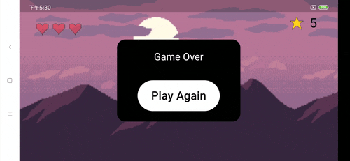

Flutter已经是大名鼎鼎了，用Flame基于Flutter做游戏，没想到效率这么高。

5天时间做了2个小游戏Demo。看来用flame能做很多有意思的事情啊。

准备做一个好玩的游戏，给我儿「牧之」。

> - [flame-engine](https://docs.flame-engine.org/latest/index.html)

  

  

> 游戏效果如下：

 
> 游戏源代码可以编译运行到web和手机端，代码链接：  
https://github.com/Espresso521/spaceshoot   
