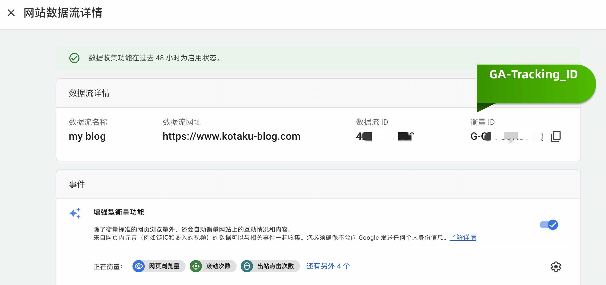
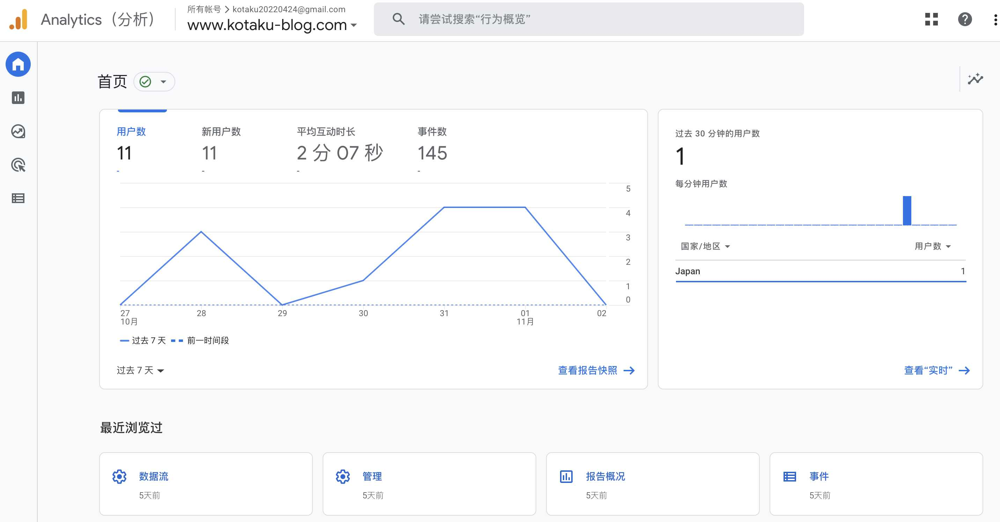

I use google analytics 4.0 to monitor and evaluate my website performance. I add dark mode for my site.

Both the functions are so easy done by Gatsby plugin : )

#### Setting up A Google Analytics account

First, sign to [Google Analytics](https://analytics.google.com/) and create an account. Then adding a Data Stream.

You can get your GA-TRACKING_ID which is for the google analytics to track your website.

> Install the google analytics plugin on your Gatsby website

    npm install gatsby-plugin-google-gtag

> Open the gatsby-config.js file and add the settings below in your plugins array

    {
      resolve: `gatsby-plugin-google-gtag`,
      options: {
        // You can add multiple tracking ids and a pageview event will be fired for all of them.
        trackingIds: [
          "YOUR GA-TRACKING_ID", // Google Analytics / GA
        ],
        // This object is used for configuration specific to this plugin
        pluginConfig: {
          // Puts tracking script in the head instead of the body
          head: true,
        },
      },
    }

> Build and serve the production version of your Gatsby site

    gatsby build
    gatsby serve

You will see the result like this.

#### Use gatsby-plugin-use-dark-mode and use-dark-mode

    npm install gatsby-plugin-use-dark-mode use-dark-mode

> Add the plugin

      module.exports = {
          plugins: [`gatsby-plugin-use-dark-mode`, `gatsby-plugin-material-ui`],
      };

> Add the switch button

    export default function DarkModeButton() {
    const darkMode = useDarkMode(false);

    return (
        <IconButton type="button" onClick={darkMode.toggle}>
            {darkMode.value ? (
                <Moon style={{color: '#ffb74d'}} />
            ) : (
                <Sun style={{color: '#ff9800'}} />
            )}
        </IconButton>
    );
    };

> Add the global CSS

    body.light-mode {
        background-color: #fff;
        color: #333;
        transition: background-color 0.3s ease;
    }

    body.dark-mode {
        background-color: #212121;
        color: #999;
        transition: background-color 0.3s ease;
    }

    .dark-mode blockquote {
        color: #999;
        border-left: 0.32813rem solid #999;
    }

Then you get the dark mode for your website

> So easy! Awesome!
