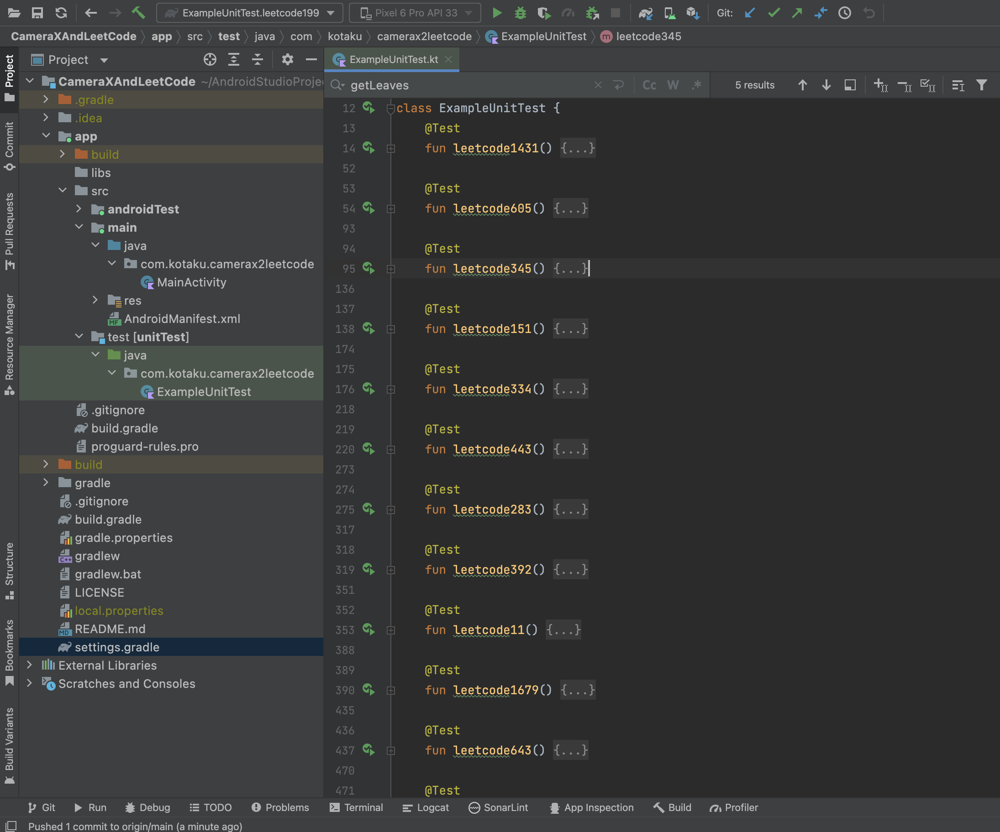

#### Binary Tree - BFS

> 二叉树的广度优先搜索的题目很多都是 Medium 难度，说明简单的原理想通过递归算法写出来，还是有难度的。  
> 此乃，知易行难也！

**请听题**

> - [199. Binary Tree Right Side View](https://leetcode.com/problems/binary-tree-right-side-view/?envType=study-plan-v2&envId=leetcode-75)  
>   给定一个二叉树的 根节点 root，想象自己站在它的右侧，按照从顶部到底部的顺序，返回从右侧所能看到的节点值。

        fun rightSideView(root: TreeNode?): List<Int> {
            // Create a list to store the rightmost values
            val rightmostValues = mutableListOf<Int>()

            // Check if the root is null, if so, return the empty list
            if (root == null) return rightmostValues

            // Create a queue to perform BFS
            val queue: Queue<TreeNode> = LinkedList()
            queue.offer(root)

            // Perform BFS
            while (queue.isNotEmpty()) {
                // Get the number of nodes at the current level
                val levelSize = queue.size

                // Variable to store the rightmost node at the current level
                var rightmostNode: TreeNode? = null

                // Process all nodes at the current level
                repeat(levelSize) {
                    // Get the node from the front of the queue
                    val node = queue.poll()

                    // Update the rightmost node
                    rightmostNode = node

                    // Add the left and right child nodes to the queue if they exist
                    node.left?.let { queue.offer(it) }
                    node.right?.let { queue.offer(it) }
                }

                // Add the value of the rightmost node to the list
                rightmostNode?.let { rightmostValues.add(it.`val`) }
            }

            // Return the list of rightmost values
            return rightmostValues
        }

刷 leetcode 的题目还是挺有意思的。由于平时开发 android 的应用，主要用 kotlin 开发，所以我开源了一个项目，里面是我做过的 leetcode 题目的 Unit Test 代码。

项目本身是使用 Android 的 CameraX 库，进行拍照，录像和图像分析的示例代码。有兴趣的小伙伴，可以下载代码，进行调试和修改。

**仓库地址**

> - [CameraXAndLeetCode](https://github.com/Espresso521/CameraXAndLeetCode)
