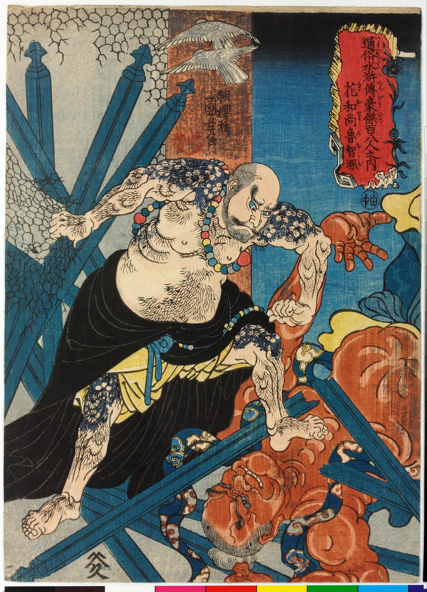

> - [天孤星花和尚鲁智深](https://zh.wikipedia.org/wiki/%E9%B2%81%E6%99%BA%E6%B7%B1)

> 鲁大师濒死之际，明心见性，**见一切法门而不染一尘**，所得到的顿悟。  

> 也可以理解为，参破因缘，免受轮回之苦，从此**不存不灭，不喜不悲，不苦不乐**，是为成佛。  

> 简单的说就是看破了人生，因为他知道了“我是谁”。

---

不存不灭，不喜不悲，不苦不乐，这不就是回归到了以太界，变为了纯能量的形式，不再眷恋物质世界的表现吗？

“今日方知我是我”这话只知妙之又妙，玄之又玄，却全然不知玄妙在何处，大概只有发出这句感悟的本人才会懂。  

我们可以由这句话推测下一下，天地万物随我而生，伴我而灭，因我而存，我即我，世间诸物仅是镜花水月，皆为虚妄，唯我而真。  

这是一种强大的自我。波澜壮阔，荡气回肠。  

苏格拉底在千年前就告诫后人，“认识你自己”。“我是谁？”“我从哪儿来？”“我要到哪里去？”终极问题困扰着全人类。   

凯撒大帝说：我来过，我看见，我征服。这是凯撒的世界观，这是他认识世界的方式。

施耐庵自然也逃不出这个终极问题的困扰。

借鲁智深之口表达了他的世界观和人生观。其实不同宗教的教义在形式上千差万别，但寻根究底其**精神内核**大多都是共通的，因为都是在反映人类的**本能诉求**。

---

> “漫揾英雄泪，相离处士家。谢慈悲，剃度在莲台下。没缘法，转眼分离乍。赤条条，来去无牵挂。那里讨，烟蓑雨笠卷单行？一任俺，芒鞋破钵随缘化！”