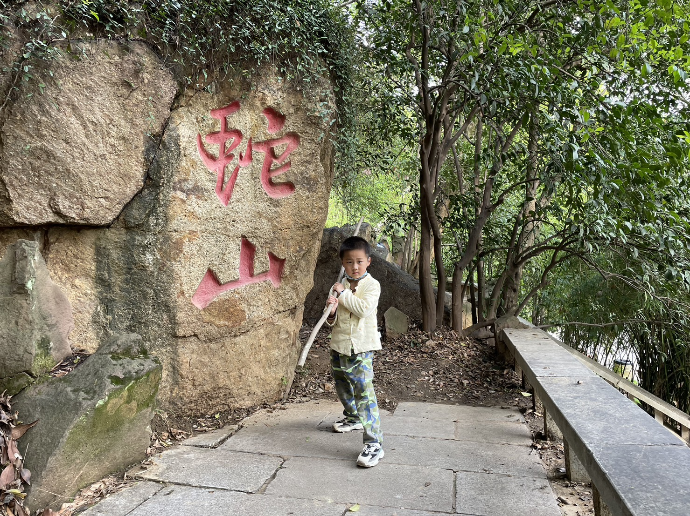

  

> 这个月开始，入职成为archbase.co.jp的IT Manager。非常感谢社长的大力支持，也感谢营业的大力支持。
>   
> 通过手机照片，回忆一下。发现到今天，我来日本还不到2年，就得到了社长的认可，得到了开发小组内日本人同事的认可。  
> 
> 就像昨天和林田桑聊天的时候说的，这是上帝的指示。感谢耶和华让我和家人能来到日本，感谢二葉先生一家人让我认识耶和华。  
> 
> 阿门！

> 在国内蛇山，估计不会再回去了。
>    
>    
>    
>

> 入学式，C位出镜
>    
>    
>    
>    
<video width="640" height="480" controls volume="0.5">
  <source src="/7.mp4" type="video/mp4">
  Your browser does not support the video tag.
</video>

> 日本公园真的很多，很好玩   
>    
<video width="640" height="480" controls volume="0.5">
  <source src="/4.mp4" type="video/mp4">
  Your browser does not support the video tag.
</video>  

> 过年小插曲，老婆手指受伤，第一叫救护车。  
>    
>   

> 干了一年的项目，顺利交付，真的不舍。  
>    
> 

> 认识了二葉先生一家，这就是上帝的指示，感谢老师，感谢耶和华，阿门！
> 

