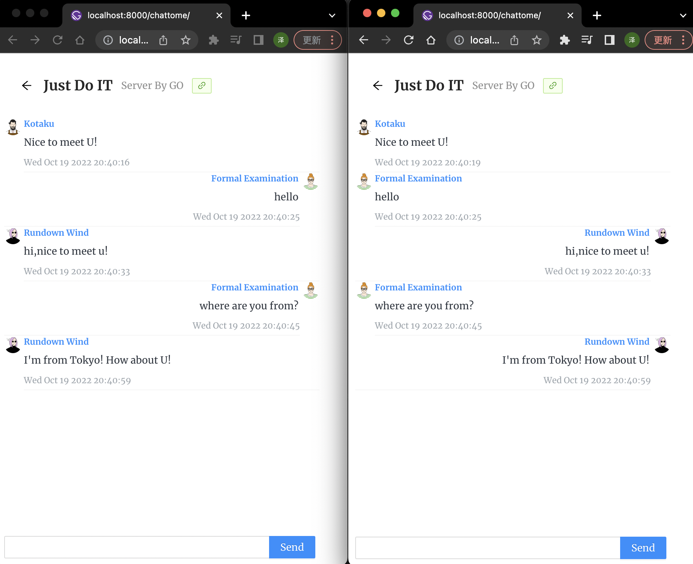

This chat room does not require registration and does not keep chat messages, only people who enter at the same time, may chat, but I am online most of the time.

It took me a week to finish this chat room.

At first I was going to use [googollee/go-socket.io](https://github.com/googollee/go-socket.io) as a backend websocket library.

The front end uses [socket.io-client](https://www.npmjs.com/package/socket.io-client) as the websocket library.

But these two libraries have compatibility issues, and I spent a day debugging them without success.

Here is the reference link of the problem：
[Can not establish a connection between my React frontend and my Go backend #408](https://github.com/googollee/go-socket.io/issues/408)

During the development, I tried to update the state inside the useEffect method and encountered the classic closure problem

So I added redux to solved the problem.

The scenario where react uses websocket is a typical scenario that requires the use of redux.

For more information about the closure problem, please refer to this article below.  
[从 react hooks state 不更新问题中,重新认识闭包](https://juejin.cn/post/6882262783224709128)

> Here's a picture of my chat room

