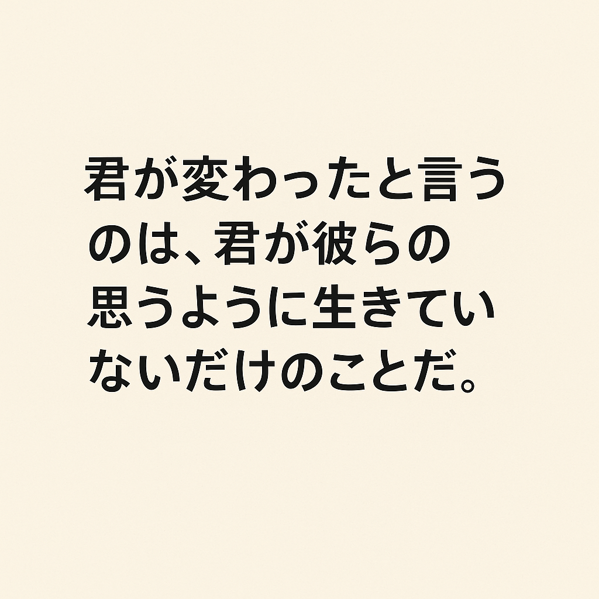
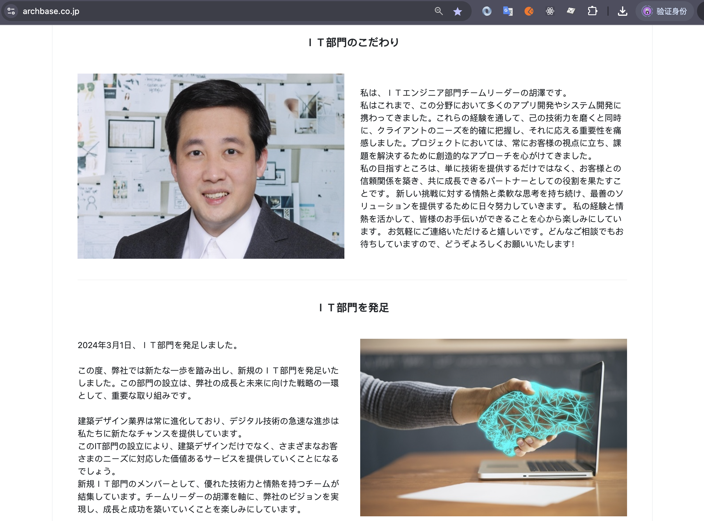
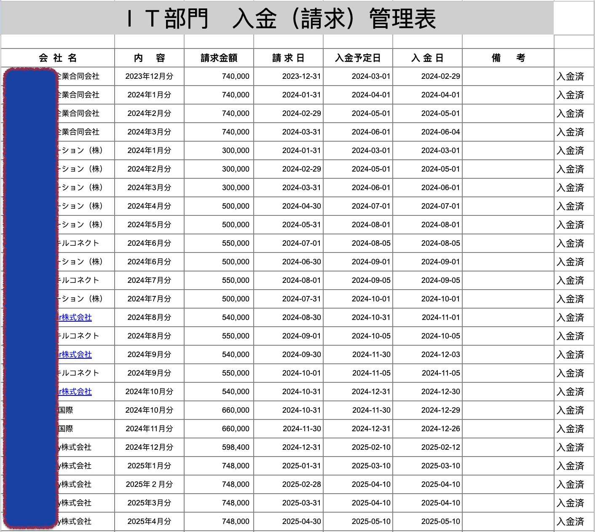
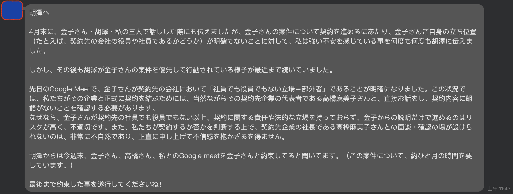
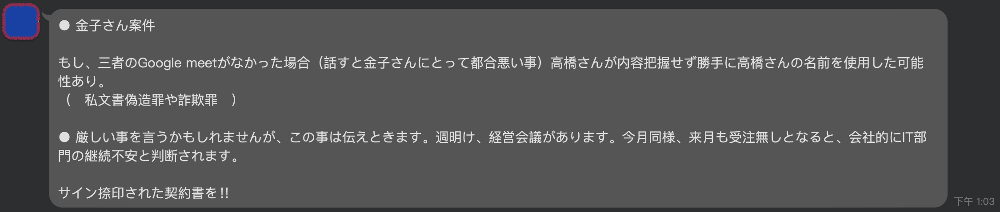
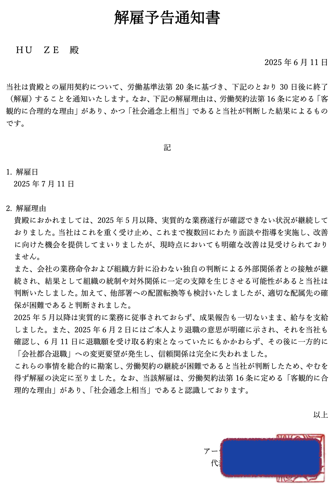
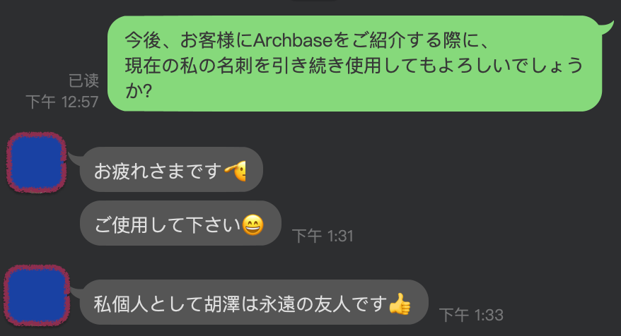

> - 别人说你变了，只是因为你没有按照他们的想法生活罢了。 ———— 弗洛伊德

> - 开始重新整理时间线，为新的未知的旅程做好准备。

1.  2024 年 3 月 1 日，我正式入职 [アーチ・ベース株式会社](https://archbase.co.jp/)，担任 IT 部门的负责人。当时的我充满期待，也深感荣幸和自豪，满怀干劲地开始了这段旅程。
    

2.  到了 2024 年 12 月 31 日，经过一整年的努力，我独自一人完成了 1100 万日元的营业额，虽然过程并不轻松，但我认为自己没有辜负组织对我的信任和期待。
    

3.  然而，2025 年 4 月 30 日，最近负责的一个项目没有继续续约，我不得不进入待机状态。
4.  从 2025 年 5 月 1 日开始，考虑到金子桑表示可能会提供新的案件，我选择耐心等待，没有主动全力去寻找新的机会。但这个决定让我们社长非常不满——因为我在待机期间仍需领工资，这对他而言是一种负担。
    
5.  终于在 2025 年 6 月 2 日，社长突然通知我不再支付工资。我们围绕这个问题争论了一周（准确地说，是用日语“吵架”了一周）。最终达成协议：以“我方原因离职”为由，公司会支付我 6 月份的工资作为结束。
    
6.  期间，他还发给我一封解雇通知书。这一连串的经历让我对“日本职场文化”以及“部分日本人对中国人和金钱的态度”有了更深刻的理解——算是一种宝贵但不那么愉快的经验积累吧。
    

经历了这一系列的事情，我对日本的职场文化和人与人之间的关系也有了新的理解。我曾向劳动局咨询相关问题，但他们表示无法给予实质性的帮助。如果想要通过法律手段维权，需要自行准备上班的相关证据，并另行寻找律师协助。他们认为这类问题属于民事纠纷，超出了劳动局的处理范围。

权衡之后，我决定不再进一步追究，而是选择提交退职届，平静地结束这段合作关系。社长收到退职届时显得颇为高兴，还对我说“我们永远是朋友”。虽然这番话让我内心有些复杂，但我也理解，每个人对“朋友”这个词的定义并不相同。

> - 好了，该总结了。

1. 首先，我真心感谢社长曾给予我这个机会，让我独立负责整个 IT 部门。虽然最终因为文化差异等原因走到了分开的局面，但我也接受并理解，只能调整好心态，继续走好接下来的路。
2. 我也希望这段经历将来能成为我儿子的一点借鉴。人生中总会遇到一些意想不到的情况，若能妥善应对，便能转化为宝贵的经验。
3. 我对自己依然充满信心。来日三年，如今又回到了最初以个人事业主的身份重新出发的状态。7 月份的项目已经确定，接下来我会继续努力，争取做得更好，也希望能为更多人带来价值。

> - 过自己想要的生活不是自私，强迫别人按自己的要求生活才是自私。———— 王尔德
