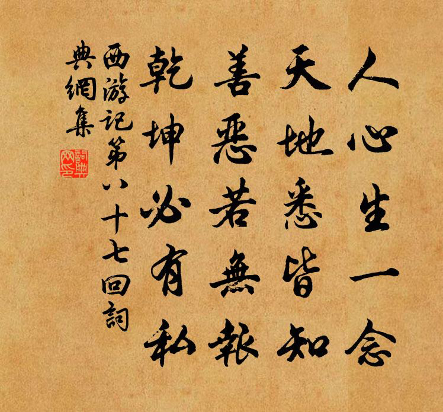

<audio controls autoplay loop>
  <source src="/bgm.mp3" type="audio/mp3" />
  Your browser does not support the audio element.
</audio>

> - 每隔一段時間，總要把《明朝那些事兒》的結尾拿出來讀一讀。

> 其實這個世上很多事，本不需要理由，之所以需要理由，是因為很多人喜歡找抽，抽久了，就需要理由了。
> 正如徐霞客臨終前，所說的那句話：“漢代的張騫，唐代的玄奘，元代的耶律楚材，他們都曾遊歷天下，然而，他們都是接受了皇帝的命令，受命前往四方。”
> “我只是個平民，沒有受命，只是穿著布衣，拿著拐杖，穿著草鞋，憑藉自己，遊歷天下，故雖死，無憾！”
>
> 說完了。
>
> 我要講的那樣東西，就在這個故事裡。我相信，很多人會問，你講了什麼？
> 用如此之多的篇幅，講述一個王朝的興起和衰落，在終結的時候，卻說了這樣一個故事，你到底想說什麼？
>
> 我重複一遍，我要講的那樣東西，就在這個故事裡，已經講完了。所以後面的話，是講給那些不明白的人，明白的人，就不用繼續看了。
>
> 此前，我講過很多東西，很多興衰起落，很多王侯將相，很多無奈更替，很多風雲變幻，但這件東西，我個人認為，是最重要的。
> 因為我要告訴你，所謂千秋霸業，萬古流芳，以及一切的一切，只是糞土，先變成糞，再變成土。
>
> 現在你不明白，將來你會明白，將來不明白，就再等將來，如果一輩子都不明白，也行。
>
> 而最後講述的這件東西，它超越上述的一切，至少在我看來。
> 但這件東西，我想了很久，也無法用準確的語言，或是詞句來表達，用最欠揍的話說，是只可意會，不可言傳。
>
> 然而我終究是不欠揍的，在遍閲群書，卻無從開口之後，我終於從一本不起眼，且無甚價值的讀物上，找到了這句適合的話。
> 這是一本台曆，一本放在我面前，不知過了多久，卻從未翻過，早已過期的台曆。我知道是上天把這本台曆放在了我的桌前，
> 他看著幾年來我每天的努力，始終的堅持，它靜靜地，耐心地等待著終結。它等待著，在即將結束的那一天，我將翻開這本陪伴我始終，卻始終未曾翻開的台曆，
> 在上面，有著最後的答案。
>
> 我翻開它，在這本台曆上，寫著一句連名人是誰都沒說明白的名人名言。
> 是的，這就是我想說的，這就是我想通過徐霞客所表達的，足以藐視所有王侯將相，最完美的結束語：

#### 成功只有一個：按照自己的方式，去度過人生。
