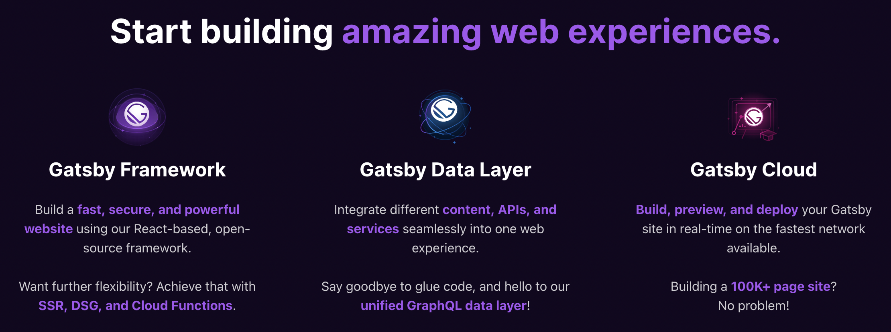
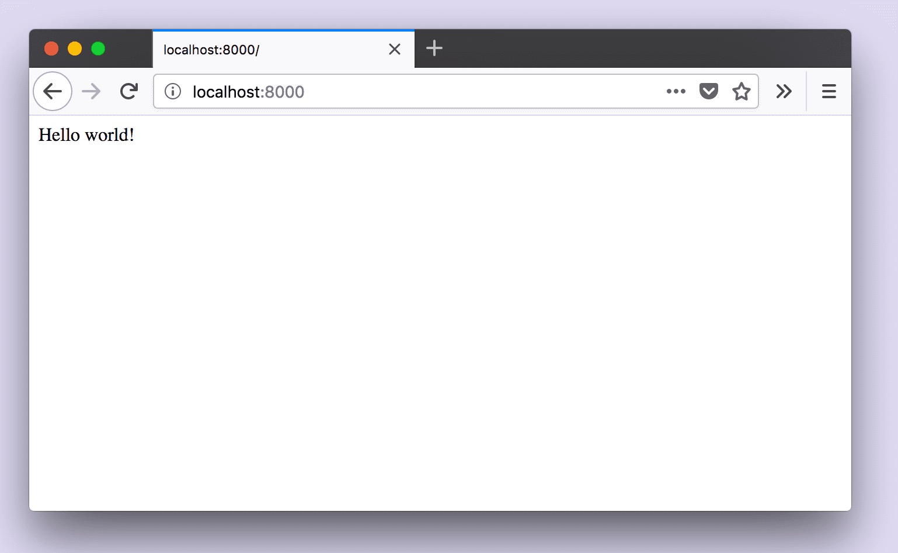

### Gatsby - The future of web development

**Gatsby** enables developers to build fast, secure, and powerful websites using a _React-based framework_ and innovative data layer that makes integrating different content, APIs, and services into one web experience incredibly simple.

##### You can get more information from **_[Gatsby](https://www.gatsbyjs.com/)_**

> 1. Combine Content & Data From Anywhere
> 2. Write Apps with Better Building Blocks
> 3. Take Web Performance to the Next Level
> 4. One-Click, Global Deployment



##### You can easily create a Gatsby website by four steps.

```js
> npm install -g gatsby-cli
> gatsby new hello-world https://github.com/gatsbyjs/gatsby-starter-hello-world
> cd hello-world
> gatsby develop
```

##### Then you can visit website **_http://localhost:8000_**



> **Building a website is hard, but Gatsby makes it easy.**
