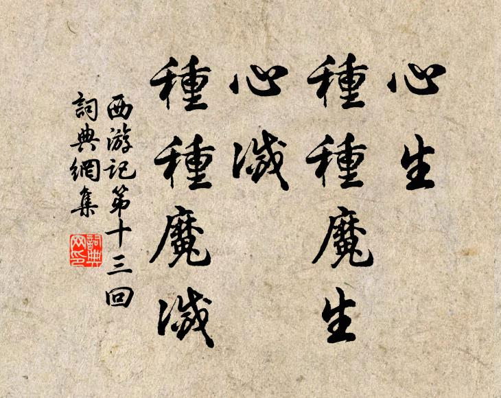

#### 解释：一生、一心尽可能专注自己的兴趣、事业及家庭。不要产生太多杂乱无章的思想，人生必可完满。

<video width="640" height="480" controls autoplay volume="0.5">
  <source src="/xiyouji.mp4" type="video/mp4">
  Your browser does not support the video tag.
</video>

> 倒着读西游记才是人生

> 如来派师徒四人与小白龙去东土大唐去传教,在一路上遇到了各种妖怪。打来打去发现他们都是有后台的,无论怎么作恶都不受惩罚。
>
> 八戒和沙僧觉得太黑暗了,无奈一个躲进了高老庄,一个钻进了流沙河,只有悟空坚持正义一路斩妖除魔护送师傅东去传教。
>
> 结果天庭对悟空实在忍无可忍就和如来达成协议——我们可以保证唐三藏平安到长安,不过你得把孙悟空这个刺儿头给办了。
>
> 如来同意了，在一翻阴谋之下，白龙重伤坠入山涧，悟空败了，被压在了五指山下,而唐三藏却抛弃了孙悟空，孤身来到长安，在长安传完教，被封为御弟，享受完荣华富贵，寿终正寝。就这样过了五百年。
>
> 悟空终于从五指山下逃了出来, 一声不吭 ,把天庭搅了个天翻地覆。
>
> 天庭被逼无奈许诺让猪八戒化为人身，封为天蓬元帅，沙和尚封为卷帘大将，只要他们能够杀掉孙悟空。
>
> 最后的最后，因为兄弟相残而心灰意冷的悟空去寻找菩提祖师解惑，然后他封印了修为，回到花果山，陪着猴子猴孙过完了平凡的一生，最终在花果山的山顶化作了一块石头……
>
> 有人说:“人这一生逃不过命”。但我们想要的究竟是什么。  
> 精彩的一生么？每个人都如此奢求，走来走去最后发现，曾经的理想竟然是那么奢侈。
>
> 我们能做的，也许只能是在自己认为是对的路上，努力的前行，要的是追梦的经历，没有困难的那不叫人生，不叫活过。
